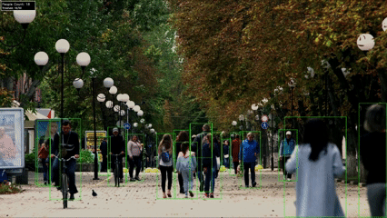

# Crowd Management System

A real-time crowd detection and counting application using YOLOv11 and OpenCV. Designed to monitor public spaces and alert when crowd density exceeds safety thresholds.

## Demo




## Features

- **Real-time Detection**: Detects people in video streams using YOLOv11
- **Threshold Alerts**: Visual and console alerts when crowd count exceeds defined limits
- **Multiple Video Sources**: Supports video files or webcam input
- **Debug Mode**: Visual debugging with bounding boxes, confidence scores, and object classification
- **Export Output**: Saves processed video with annotations

## Installation

### Prerequisites

- Python 3.12+
- [UV](https://github.com/astral-sh/uv) package manager

### Setup

```bash
# Clone the repository
git clone https://github.com/YOUR_USERNAME/crowd-management.git
cd crowd-management

# Install dependencies
uv sync
```

## Usage

### Basic Usage

```bash
# Run with default settings
uv run --active python src/crowd_counter.py
```

### Configuration

Edit `src/crowd_counter.py` to customize:

```python
# Video source (file path or 0 for webcam)
VIDEO_PATH = r"data\your_video.mp4"

# YOLO model (yolo11n.pt, yolo11s.pt, yolo11m.pt, yolo11l.pt)
MODEL_PATH = "yolo11n.pt"

# Alert threshold
THRESHOLD = 50

# Detection confidence (lower = more detections, may include false positives)
CONFIDENCE = 0.10

# NMS IOU threshold (higher = fewer overlapping detections)
IOU_THRESHOLD = 0.5
```

### Model Options

| Model | Size | Speed | Accuracy |
|-------|------|-------|----------|
| yolo11n.pt | Nano | Fastest | Good |
| yolo11s.pt | Small | Fast | Better |
| yolo11m.pt | Medium | Moderate | Best |
| yolo11l.pt | Large | Slow | Excellent |

Models are automatically downloaded on first use.

### Controls

- Press `q` to quit
- Close the video window to exit

## Project Structure

```
crowd-management/
├── .gitignore
├── README.md
├── pyproject.toml
├── run.py                   # Entry point script
├── assets/                  # Demo GIFs and screenshots
│   └── demo.gif            # Demo GIF (to be added)
├── data/                    # Store your videos here (gitignored)
│   └── example.mp4
└── src/
    └── crowd_counter.py     # Main application
```

## Output

- **Console**: Real-time count, maximum count, and threshold status
- **Video Window**: Live view with bounding boxes and counters
- **File**: `output.mp4` - Processed video with annotations

## Example Output

```
Starting crowd counting with threshold: 50
Model: yolo11n.pt | Confidence: 0.10 | IOU: 0.5
============================================================
DEBUG MODE ON - First 30 frames will show ALL detections
Green boxes = People | Yellow boxes = Other objects
============================================================
Press 'q' to quit

=== FRAME 1 ===
People detected: 23
Total objects: 25
Objects detected:
  - person: 23
  - car: 2

Frame 30: 27 people | Max so far: 31

============================================================
=== Final Results ===
Total frames processed: 300
Maximum people detected: 45
Threshold was NOT exceeded
============================================================
```

## Troubleshooting

### Low Detection Count

If the application is not detecting enough people:

1. **Lower confidence threshold**: `CONFIDENCE = 0.05`
2. **Use larger model**: `MODEL_PATH = "yolo11s.pt"` or `"yolo11m.pt"`
3. **Adjust IOU**: `IOU_THRESHOLD = 0.4` for crowded scenes

### Too Many False Positives

1. **Increase confidence**: `CONFIDENCE = 0.25`
2. **Use nano model**: `MODEL_PATH = "yolo11n.pt"`

### Performance Issues

1. **Use nano model**: `MODEL_PATH = "yolo11n.pt"`
2. **Skip frames**: Process every Nth frame
3. **Lower resolution**: Resize video before processing

## License

MIT License - feel free to use this project for any purpose.

## Contributing

Contributions are welcome! Please feel free to submit a Pull Request.

## Acknowledgments

- [Ultralytics YOLOv11](https://github.com/ultralytics/ultralytics) - Object detection model
- [OpenCV](https://opencv.org/) - Computer vision library
